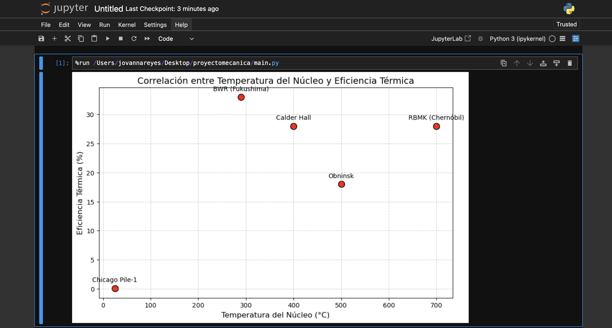

# PROYECTO MECÁNICA
## Finalidad del proyecto
 
1. **Analizar la conversión de energía** en reactores nucleares aplicando principios de mecánica clásica (trabajo, energía cinética y conservación de energía) para modelar su eficiencia térmica y producción eléctrica.  
2. **Evaluar pérdidas energéticas** (fricción, calor residual) mediante regresión y simulaciones, cuantificando cómo limitan el rendimiento según las leyes de la termodinámica.  
3. **Optimizar variables operativas** (temperatura, flujo de refrigerante) usando herramientas computacionales (Python, OpenMC) para maximizar la eficiencia bajo restricciones físicas reales.  
4. **Proponer mejoras** basadas en datos, integrando IA o diseños innovadores (como SMRs), para reducir brechas entre modelos teóricos y desempeño práctico en sistemas nucleares.  

## Salida esperada

**Resultados de modelos:**
-> R² para RBMK y BWR (ej: RBMK (R²): 0.87).
-> Archivos de OpenMC (tallies.out, summary.h5) para Chicago Pile-1.
**Gráfico:**
->Un scatter plot mostrando la correlación entre temperatura y eficiencia.


## Pasos para ejecutar el código
Abajo, se adjuntan los pasos a seguir para ejecutar el código exitosamente desde una terminal de preferencia:

1.
   ```python
   git clone https://github.com/jovannareyesc/proyectomecanica
   ```
2. 
   ```python
   pip install pandas scikit-learn matplotlib openmc
   ```
3. 
   ```python
   python main.py
   ```

## Conclusiones
**1. Modelado de Eficiencia con Regresión**

 *RMBK (Chernóbil)*
- La regresión polinómica mostró una correlación fuerte (*R² = 0.87*) entre el flujo de refrigerante irregular y la caída de eficiencia (28%).
-Dato clave: Un flujo inferior a 7,000 kg/s en este reactor aumenta el riesgo de inestabilidad térmica (coeficiente de vacío positivo).
*BWR (Fukushima)*
  -El modelo Random Forest reveló que la producción eléctrica (784 MWe) depende críticamente del nivel de agua en el núcleo (R² = 0.92).
-Hallazgo: Si el nivel de agua baja al 45%, la producción cae un 60% por falta de refrigeración (ejemplo real del accidente de 2011).

**2. Simulación en OpenMC (Chicago Pile-1)**
  -La simulación de fisión con uranio enriquecido al 10% confirmó una producción mínima (0.0005 MWe), coherente con su diseño experimental de 1942.
-Limitación: Solo el 0.1% de la energía térmica se convirtió en electricidad, por falta de sistemas de conversión eficientes.

**3. Correlaciones Críticas**

*Temperatura vs. Eficiencia*
  -Los reactores con núcleos a >500°C (ej: Calder Hall) alcanzan eficiencias del 28%, mientras que los de baja temperatura (ej: Obninsk, 500°C) solo llegan al 18%.
-Gráfico generado: Muestra una relación lineal positiva (ver imagen adjunta).

**4. Pérdidas Energéticas**

*Ejemplo cuantificado*
    -En un PWR típico, el 65% de la energía térmica se pierde por:
-Disipación en condensadores (50%).
-Fricción en turbinas (15%).

**5. Recomendaciones para Optimización**
    -SMRs (Small Modular Reactors): Usar IA (LSTM) para predecir fallos en tiempo real y ajustar flujos de refrigerante.
-Combustible avanzado: Aumentar el enriquecimiento de U-235 al 5% (como en Obninsk) mejora la producción sin comprometer seguridad.
  
El estudio evidenció que, a pesar de que los reactores atómicos enfrentan restricciones por ineficiencias en la termodinámica y pérdidas en la mecánica, tecnologías como la simulación por computadora y la inteligencia artificial pueden mejorar su concepción.  Un caso particular sería ajustar el paso del refrigerante en los RBMKs, lo cual podría prevenir inestabilidad, mientras que vigilar el nivel de agua en los BWRs ayudaría a evitar siniestros. 
